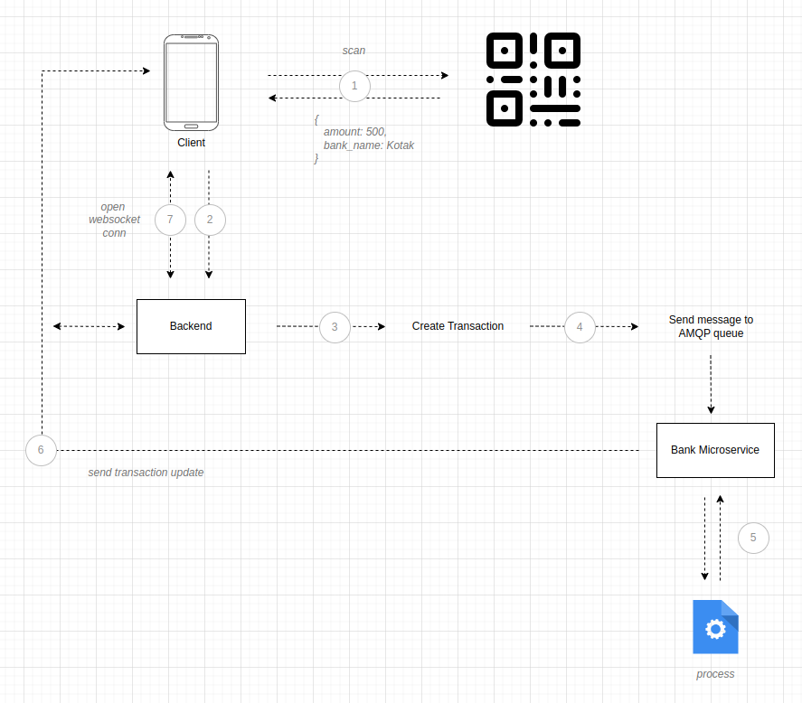

# Payment System | Backend
`v1.x.x`

## Description

This backend system replicates a system like google pay, on a lower level.
<br/>
By using this system, client will be able to :
- create transactions with details
- recharge their wallets
- check whether transactions were successful or not
- check wallet ledgers
<br></br>

## Spinning up the server using Docker
1. The following command will start the Node JS server.
    ```
    docker-compose up --build
    ```
2. It will also create a new network called `payment_payment`, to which the microservice will connect (`network bridge` created so that this backend container can accept requests from other containers, locally).
<br></br>

## Creating Resources on the server
1. Run the [service-01](https://github.com/hardikambati/transaction-service01) microservice to process the transaction request (refer readme file for setup).
2. Check the `app.js` file, which includes all the routes (API's).
3. Initially, You can create a user, then a transaction, try to fetch those transactions (basic CRUD operations).
4. Once a user is created, You can recharge wallet, check transactions summary etc. 
<br></br>

## Listening to websocket channel
1. In the backend We are using Socket.io, thus, We need socket io client on the frontend.
    ```
    http://localhost:8000?token=<authorization_token>
    ```
2. A transaction update will be received on the connected websocket.
<br></br>

## Architecture that describes everything!


<br></br>

## NOTE
We have a frontend which easily integrates with this backend system, so that creating transactions and listening to events, and using other features becomes much easy.
<br/>
Will be adding the repo link soon!


